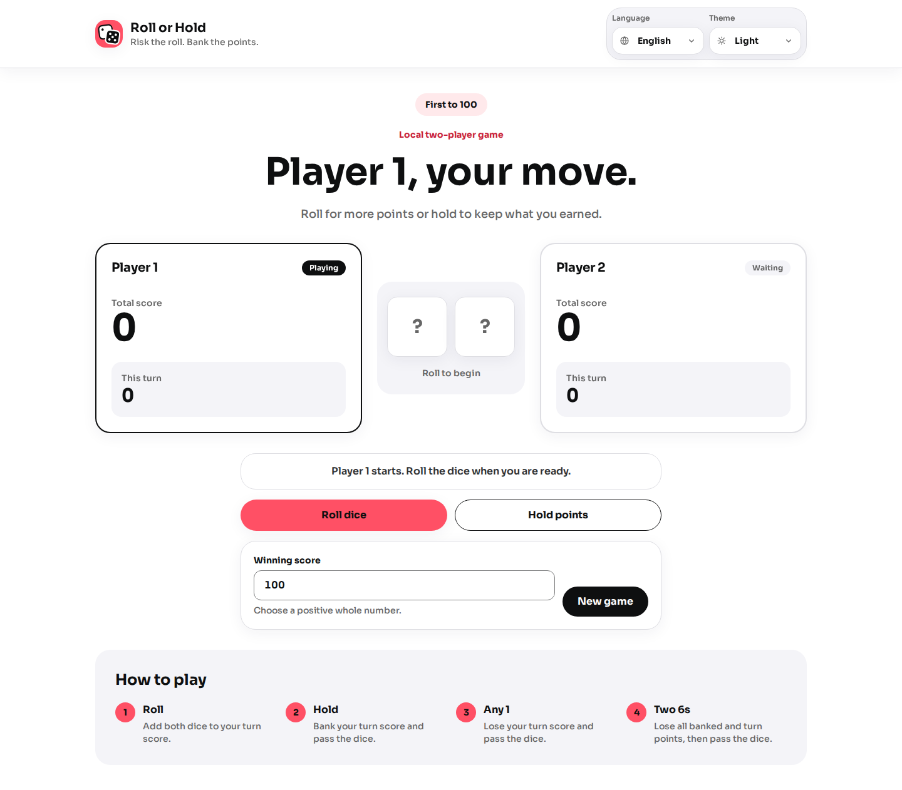
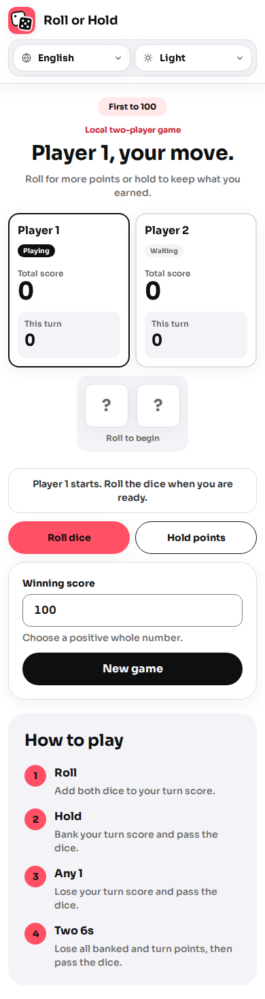

# Roll or Hold

Roll or Hold is a local two-player dice game about balancing risk and reward. It is a small,
static Preact application prepared for GitHub Pages while preserving the complete rule set from
the original JavaScript exercise.

## Preview

### Desktop



### Mobile



## Product contract

### Game rules

- A match has two local players and uses two six-sided dice.
- The default winning score is 100. A new match may use another positive whole-number target.
- A player starts a turn with zero unbanked points.
- A regular roll adds both dice to the unbanked turn score.
- If either die shows 1, the player loses all unbanked points and the turn passes immediately.
- If both dice show 6 in the same roll, the player loses the entire banked score, loses all
  unbanked points, and the turn passes immediately.
- Holding adds the unbanked turn score to the player's banked score and passes the turn.
- The first player whose banked score reaches or exceeds the winning score wins the match.
- Rolling and holding are disabled after a winner has been declared.
- Starting a new match resets both players, the turn score, dice state, active player, and winner.

### Winner experience

Winning must be an explicit application state rather than a color-only decoration. The interface
must announce the winner, identify the winning player in the board, disable unavailable gameplay
actions, and present a clear action for starting another match. Assistive technologies must receive
the result through an appropriate live announcement.

### Interface requirements

- Support phone, tablet, and desktop layouts without horizontal overflow, starting at 320px wide.
- Follow the system color scheme until the player explicitly chooses Light or Dark, then persist
  that choice with equivalent hierarchy and contrast in both themes.
- Provide English and Brazilian Portuguese, prefer an explicit saved choice, otherwise detect the
  browser language, and fall back to English.
- Keep game status, the active player, banked scores, unbanked score, dice results, winning target,
  and primary actions visible and understandable.
- Remain fully usable with a keyboard, visible focus, reduced motion, and enlarged text.
- Draw the dice as code-native UI. Do not depend on dice images or a photographic background.
- Follow the coral-on-neutral visual direction and semantic tokens in `docs/DESIGN.md`.

## Stack

- Preact, TypeScript, and Vite
- i18next with typed English and Brazilian Portuguese catalogs
- Tailwind CSS 4 with semantic light and dark theme tokens
- Vitest and Testing Library for unit and component tests
- Playwright and axe for browser, responsive, and accessibility checks
- Biome for linting and formatting
- pnpm for dependency management
- GitHub Actions and GitHub Pages for continuous delivery

The application will remain static. It will not require a backend, database, runtime API, or
client-side secret.

## Requirements

- Node.js 24
- pnpm 10

## Local development

```bash
pnpm install
pnpm dev
```

Install the Git hooks once per clone:

```bash
pnpm exec lefthook install
```

## Quality checks

Run the TypeScript, lint, unit-test, formatting, build, and static-output checks:

```bash
pnpm check
```

Run the responsive browser and accessibility checks separately:

```bash
pnpm exec playwright install chromium
pnpm test:e2e
```

## Production build

```bash
pnpm build
pnpm preview
```

The build output is written to `dist/` and uses `/roll-or-hold/` as its GitHub Pages project path.
The GitHub Pages workflow deploys the verified `dist/` artifact from `master`. The production URL
will be added after the repository has been renamed and the first deployment has completed.

## Development policy

All modernization work is isolated on `refactor/roll-or-hold` until it has been reviewed. Source
code, code comments, test names, technical documentation, and commit messages are written in
English. Commits follow Conventional Commits and are created only after explicit review and
authorization.

See `AGENTS.md` for the maintained engineering rules.
